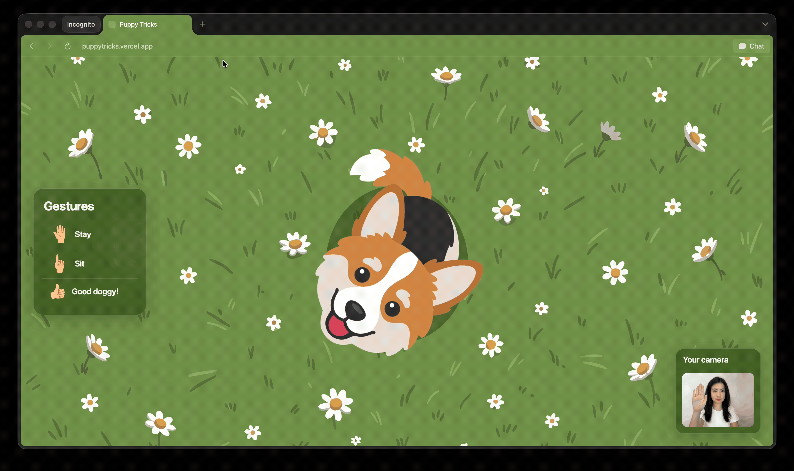

# Puppy Tricks

A gesture-controlled corgi that reacts to your hand movements via webcam. No clicking, no controls, just gestures.

🔗 **[Live demo](https://puppytricks.vercel.app)**

## How it works

Show your hand to the camera and the corgi responds in real time using on-device gesture recognition. Nothing is sent to a server.

| Gesture | Action |
|---|---|
| ✋ Open palm | Stay |
| ☝️ Point up | Sit |
| 👍 Thumbs up | Good doggy! |

## Tech stack

- [MediaPipe Gesture Recognizer](https://developers.google.com/mediapipe) for real-time hand gesture detection
- Vanilla JavaScript, CSS, and SVG (no frameworks)
- No backend, fully client-side
- Deployed on [Vercel](https://vercel.com)

## Run locally

\`\`\`bash
git clone https://github.com/shuhui-goh/puppytricks.git
cd puppytricks
python3 -m http.server 8080
\`\`\`

Then open \`localhost:8080\` in your browser. Desktop only, requires a webcam.

## Notes

- Works best on desktop with good lighting
- First gesture detection may take a moment while the model loads
- Not supported on mobile (one hand is needed to hold the phone, which conflicts with the gesture interaction)
- Anonymous usage analytics (camera permission outcomes, gestures triggered, hints shown) are collected via Supabase to inform UX decisions. No personal data is collected.

## Releases

See [Releases](https://github.com/shuhui-goh/puppytricks/releases) for version history and changelogs.

## License

MIT
